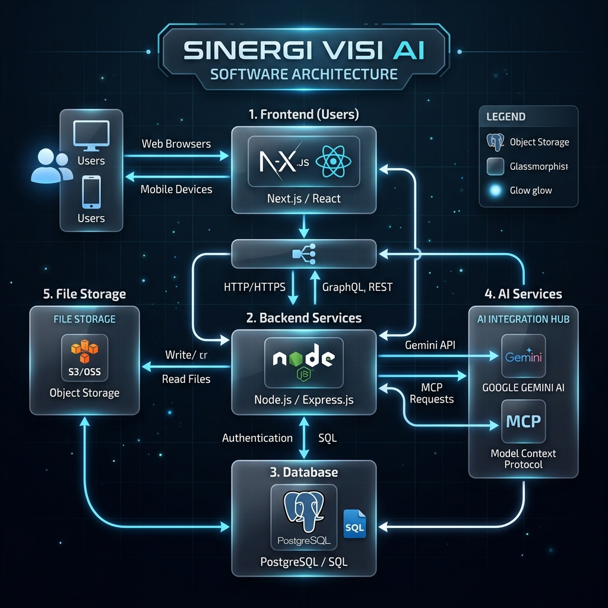

# Arsitektur Proyek: Sinergi Visi AI

Sinergi Visi AI adalah sistem manajemen klaim berbasis AI multimodal yang dirancang untuk mempercepat interaksi antara pelanggan dan agen admin menggunakan Vision AI dan komunikasi real-time.

## Ikhtisar Sistem

Aplikasi ini menggunakan arsitektur terpisah (*decoupled*) dengan frontend Next.js dan backend berbasis Express yang berfungsi sebagai lapisan orkestrasi pusat untuk AI, WebSockets, dan operasi Database.

> [!NOTE]
> Jika diagram di atas tidak muncul, pastikan Anda melihat file ini melalui previewer Markdown yang mendukung gambar lokal atau periksa folder `public/`.

---

## Komponen Utama

### 1. Frontend (Next.js)
- **Framework**: Next.js 16 (App Router)
- **Manajemen State**: React Hooks & Socket.io-client untuk sinkronisasi real-time.
- **Sistem UI**: Tailwind CSS 4 & Framer Motion untuk estetika premium dan animasi.
- **Modul Kunci**:
    - `app/admin`: Dashboard admin untuk mengelola klaim.
    - `app/customer`: Antarmuka pelanggan untuk mengajukan klaim dan chat dengan AI/Agen.
    - `components/`: Komponen UI modular (ChatPanel, ClaimDetails, ImagePreview).

### 2. Backend (Express.js)
- **Peran**: API Gateway, WebSocket Server, dan Orkestrator Logika Bisnis.
- **Server**: `server.js` (Server HTTP/Express kustom).
- **Pola Arsitektur**: Controller-Service-Middleware.
    - `controllers/`: Menangani logika permintaan (Auth, Klaim, Keamanan).
    - `services/`: Logika bisnis dan integrasi eksternal (Gemini AI, MCP).
    - `middlewares/`: Keamanan, Autentikasi JWT, dan penanganan file Multer.
    - `sockets/`: Mengelola room real-time dan penyiaran pesan.

### 3. AI & Logika Cerdas
- **Analisis Multimodal**: Menggunakan `Google Generative AI` (Gemini) untuk menganalisis gambar produk terhadap deskripsi klaim.
- **Pengenalan Intensi**: Backend mengurai tag yang dihasilkan AI (misalnya, `[INTENT:REQUEST_PHOTO]`) untuk memicu transisi UI.
- **Integrasi MCP**: Menggunakan `Model Context Protocol` untuk memperkaya respons AI dengan data eksternal atau kapabilitas alat.

### 4. Lapisan Data
- **Database**: PostgreSQL untuk data terstruktur (Klaim, Pengguna, Riwayat Chat, Log Keamanan).
- **Skema**: Dikelola melalui `schema.sql`.
- **Penyimpanan Objek**: Sistem file lokal (`/uploads`) untuk penyimpanan sementara gambar klaim.

---

## Stack Teknis

| Kategori | Teknologi |
| :--- | :--- |
| **Frontend** | Next.js, React, Tailwind CSS 4, Framer Motion |
| **Backend** | Node.js, Express 5, Socket.io |
| **AI** | Google Gemini (Generative AI SDK), MCP SDK |
| **Database** | PostgreSQL |
| **Autentikasi** | JWT (JSON Web Tokens), Bcrypt.js |
| **Penanganan File** | Multer |

---

## Alur Kerja Kunci

### Pengajuan & Analisis Klaim
1. Pelanggan mengunggah gambar melalui Antarmuka Chat.
2. Backend Express menyimpan file dan memicu `mcpService` / `Gemini AI`.
3. Gemini menganalisis gambar untuk kerusakan dan membandingkannya dengan metadata pesanan.
4. Hasilnya disimpan ke PostgreSQL dan disiarkan ke Admin melalui WebSockets.

### Human-in-the-Loop (Handoff)
1. AI mengelola asupan awal.
2. Jika klaim rumit atau memerlukan keputusan, Agen Admin bergabung ke dalam room.
3. Socket.io memastikan Pelanggan dan Admin melihat status chat yang sama secara real-time.

### Keamanan & Audit
- Semua tindakan administratif dicatat dalam tabel `security_logs`.
- JWT memastikan hanya agen resmi yang dapat mengakses endpoint `/api/admin` dan `/api/claims`.

---

## Infrastruktur & Deployment

- **Kontainerisasi**: `Dockerfile` disediakan untuk build multi-stage.
- **Lingkungan**: Dioptimalkan untuk **Google Cloud Run** dan lingkungan VPS.
- **Reverse Proxy**: Nginx (dikonfigurasi sebagai proxy untuk port Express dan upgrade WebSocket).
- **CI/CD**: Panduan deployment tersedia di `DEPLOY_CLOUDRUN.md`.
